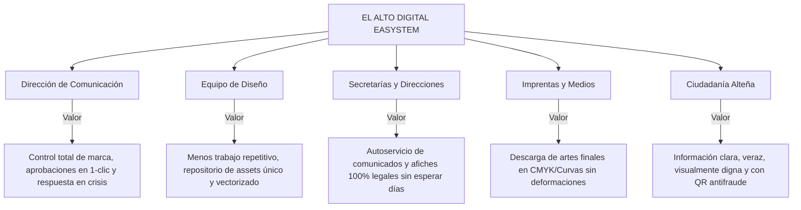

# DOCUMENTO 01: VISIÓN DEL PRODUCTO Y FILOSOFÍA DE MARCA
## EL ALTO DIGITAL EASYSTEM (EASystem)
**Gobierno Autónomo Municipal de El Alto — Dirección de Comunicación**

---

### METADATOS DEL DOCUMENTO
- **Código**: `DOC-SDD-001`
- **Versión**: `1.0.0`
- **Fecha**: `2026-09-29`
- **Estado**: `Aprobado por el Equipo Multidisciplinario`
- **Autores**: Product Owner, Branding Lead & Director de Comunicación Institucional

---

## 1. INTRODUCCIÓN Y CONTEXTO HISTÓRICO-MUNICIPAL
La ciudad de El Alto, situada a más de 4.000 metros sobre el nivel del mar, es el epicentro demográfico, económico y cultural más dinámico y transformador de Bolivia. Con una población mayoritariamente joven, emprendedora y de raíces aymaras y migrantes, la identidad alteña no es estática: es resiliencia, fuerza, vanguardia y futuro.

Históricamente, los manuales de imagen institucional en entidades públicas bolivianas han sufrido de tres males endémicos:
1. **Inertia Documental**: Manuales extensos en formato PDF que quedan archivados en oficinas y nunca son consultados oportunamente.
2. **Dispersión y Anarquía Visual**: Secretarías, direcciones e imprentas contratadas que modifican colores, aplastan logotipos, inventan submarcas caprichosas o usan tipografías no autorizadas.
3. **Burocracia y Lentitud en Crisis**: El diseño de un comunicado oficial o afiche de alerta ciudadana demora horas por la necesidad de intervención manual de diseñadores saturados.

**EL ALTO DIGITAL EASYSTEM** nace para erradicar este problema, transformando las directrices de diseño en código vivo, servicios web y herramientas de autoservicio gobernadas por software inteligente.

---

## 2. FILOSOFÍA DE MARCA Y SEMIÓTICA VISUAL

### 2.1. El Concepto Rector
> *"Un sistema inteligente para proteger, gestionar y evolucionar la identidad visual y comunicacional de la ciudad de El Alto."*

### 2.2. La Metáfora del Aguayo
El **Aguayo** andino no es solo un textil tradicional; es una estructura matemática de hilos entrelazados que representan linajes, caminos, historias y organización comunitaria.
En **EASystem**, el Aguayo se digitaliza como metáfora de:
- **Trama de Conectividad**: La fibra óptica y los datos públicos que tejen la ciudad digital.
- **Líneas Dinámicas**: Convergencia de las múltiples identidades alteñas (cholets, ferias, industrias, universidades, cultura andina).
- **Interoperabilidad**: Cada hilo respeta un patrón pero forma una sola pieza de resistencia insuperable.

### 2.3. Sistema Cromático Institucional (Tokens Oficiales)
| Color Token | Denominación Institucional | Código HEX | RGB | CMYK | Significado Semiótico |
|---|---|---|---|---|---|
| `brand-purple-primary` | **Púrpura Alteño** | `#4B008F` | 75, 0, 143 | 82, 98, 0, 0 | Dignidad, liderazgo metropolitano, institucionalidad |
| `brand-pink-rebel` | **Rosa Rebelde** | `#F5007B` | 245, 0, 123 | 0, 100, 35, 0 | Juventud, dinamismo, fuerza alteña y celebración |
| `brand-teal-future` | **Turquesa Integración**| `#008F89` | 0, 143, 137 | 85, 20, 48, 4 | Modernidad, tecnología, salud y medio ambiente |
| `brand-gold-culture` | **Oro Cultura** | `#F5B400` | 245, 180, 0 | 0, 30, 100, 0 | Riqueza ancestral, luz del altiplano y economía popular |
| `brand-purple-deep` | **Púrpura Profundo** | `#690BB2` | 105, 11, 178| 70, 95, 0, 0 | Jerarquía de contraste, fondos nobles y sobriedad |

### 2.4. Jerarquía Tipográfica
- **Gotham (Titulares, Monogramas y Señalética)**: Representa la solidez geométrica de la arquitectura alteña, la contundencia de sus demandas históricas y la modernidad de su industria.
- **Poppins (Cuerpo, Interfaces Digitales y Accesibilidad)**: Tipografía sans-serif geométrica con terminaciones amigables y alta legibilidad en pantallas de bajo contraste o dispositivos móviles populares.

---

## 3. PROPUESTA DE VALOR POR STAKEHOLDER

---

## 4. INSPIRACIÓN EN EL NYC DESIGN SYSTEM Y BRAND ARCHITECTURE
Siguiendo las mejores prácticas mundiales de gobernanza de identidad metropolitana (como el reconocido *NYC Design System* del gobierno de Nueva York), **EASystem** adopta un modelo de **Endorsed Brand Architecture (Marca Avalada)**:
1. **Marca Primaria (Masterbrand)**: `El Alto - Corazón de la Metrópoli`. Es innegociable y preside toda comunicación.
2. **Submarcas de Primer Nivel**: `Alcaldía Municipal de El Alto` y sus Secretarías Generales (ej. *Secretaría de Movilidad Urbana, Secretaría de Salud*). Usan el monograma oficial con descriptores en tipografía estandarizada.
3. **Submarcas de Programa/Campaña**: Programas temporales o de alto impacto ciudadano (ej. *El Alto Limpio, Juventud Alteña Digital*). Mantienen el ancla cromática y el sello de aval del GAMEA en posición obligatoria.

---

## 5. IMPACTO EN LA CIUDAD DIGITAL
EASystem no es únicamente una herramienta interna de diseño; es el cimiento de la **Identidad de Servicios Digitales de El Alto**. Cualquier portal web municipal, aplicación móvil ciudadana o trámite en línea futuro consumirá directamente los **Design Tokens** y componentes de EASystem, garantizando una experiencia de usuario gubernamental homogénea, accesible (WCAG 2.1 AA) y de orgullo metropolitano.
