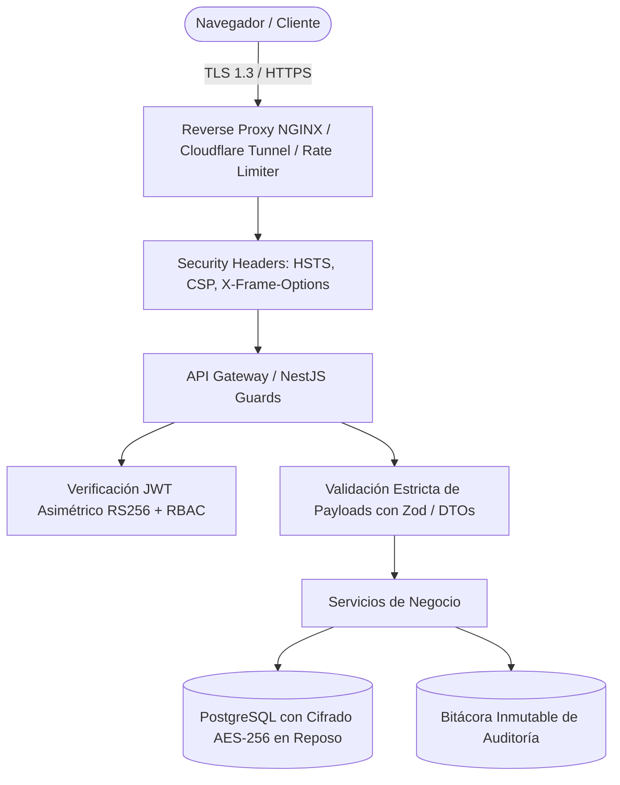

# DOCUMENTO 03: REQUERIMIENTOS TÉCNICOS Y SEGURIDAD GUBERNAMENTAL
## EL ALTO DIGITAL EASYSTEM (EASystem)
**Gobierno Autónomo Municipal de El Alto — Dirección de Comunicación**

---

### METADATOS DEL DOCUMENTO
- **Código**: `DOC-SDD-003`
- **Versión**: `1.0.0`
- **Fecha**: `2026-09-29`
- **Estado**: `Aprobado por el Equipo Multidisciplinario`
- **Autores**: Arquitecto de Software Senior & Ingeniero DevOps

---

## 1. REQUERIMIENTOS TÉCNICOS NO FUNCIONALES (RNF)

| Categoría | Especificación / Métrica Objetivo |
|---|---|
| **Disponibilidad** | 99.9% uptime mensual para servicios públicos y API de validación. |
| **Rendimiento Web** | Time to First Byte (TTFB) < 200ms; Largest Contentful Paint (LCP) < 1.5s en conexiones 4G/LTE bolivianas. |
| **Concurrencia** | Soporte para 1.000 usuarios concurrentes en la landing pública y 100 operadores en el panel administrativo simultáneamente. |
| **Tiempo de Renderizado Gráfico** | Generación de piezas PNG/SVG < 1.2 segundos; generación de PDF para imprenta 300 DPI < 3.5 segundos. |
| **Accesibilidad** | Cumplimiento estricto con las pautas **WCAG 2.1 Nivel AA** (contraste cromático, navegación por teclado, soporte de lectores de pantalla). |
| **Soberanía de Infraestructura** | Cero fuga de datos hacia nubes públicas sin control municipal; arquitectura On-Premise/Self-Hosted. |

---

## 2. ESPECIFICACIÓN DEL STACK TECNOLÓGICO

### 2.1. Frontend (Web y Aplicación de Panel)
- **Framework**: **Next.js 14+ / React 18+** utilizando **App Router** y Server Components para máxima velocidad de entrega y SEO gubernamental.
- **Lenguaje**: **TypeScript 5.x** con configuración estricta (`strict: true`, `noUncheckedIndexedAccess: true`).
- **Estilos**: **Vanilla CSS / CSS Modules** basados 100% en variables de CSS nativas vinculadas a los **Design Tokens** institucionales.
- **Motor Gráfico en Navegador**: **HTML5 Canvas / Konva.js / Fabric.js** para renderizado interactivo y previsualización WYSIWYG de plantillas.
- **Iconografía**: **Lucide Icons** con trazado vectorial optimizado.

### 2.2. Backend y Servicios
- **Framework**: **NestJS (Node.js LTS)** con arquitectura modular y principios de Domain-Driven Design (DDD).
- **Procesamiento Gráfico del Lado del Servidor**:
  - **Sharp**: Renderizado de imágenes de ultra alto rendimiento y manipulación de perfiles de color ICC (sRGB y CMYK FOGRA39).
  - **PDFKit / Puppeteer Core**: Generación de documentos PDF oficiales con vectores incrustados, marcas de corte e incrustación de tipografías Gotham y Poppins.
- **Colas Asíncronas**: **BullMQ** sobre **Redis 7** para balancear cargas de renderizado masivo y validación de archivos pesados.

### 2.3. Persistencia y Almacenamiento Soberano
- **Base de Datos Transaccional**: **PostgreSQL 16** con esquemas separados:
  - `auth`: Identidad, sesiones, roles y permisos.
  - `brand`: Tokens, reglas normativas, paletas, metadatos de marcas.
  - `templates`: Definiciones JSON de plantillas y layouts de canvas.
  - `assets`: Catálogo BAM y metadatos de recursos gráficos.
  - `audit`: Bitácoras inmutables con hashes encadenados.
- **Almacenamiento de Objetos**: **MinIO Object Storage** (API S3 compatible), desplegado en el clúster local con buckets segregados:
  - `easystem-public`: Assets públicos de prensa y logos oficiales.
  - `easystem-vault`: Fuentes tipográficas licenciadas, plantillas maestras y documentos de trabajo protegidos.
  - `easystem-renders`: Almacenamiento temporal y permanente de piezas generadas.

---

## 3. SEGURIDAD Y DEFENSA EN PROFUNDIDAD (POLÍTICA GUBERNAMENTAL)

### 3.1. Prácticas de Ciberseguridad Mandatarias
1. **Comunicaciones Cifradas**: TLS 1.3 obligatorio con certificados SSL gestionados automáticamente (Let's Encrypt / Vault institucional).
2. **Autenticación Fuerte**:
   - Firmado de tokens con llaves asimétricas **RS256** (rotación programada cada 90 días).
   - Cookies `HttpOnly`, `Secure` y `SameSite: Strict` para evitar ataques XSS y CSRF.
3. **Validación de Carga de Archivos (Brand Validator)**:
   - Detección de tipo MIME mediante inspección de *magic numbers* (bytes iniciales del archivo), nunca por la extensión declarada.
   - Escaneo antivirus local con **ClamAV** en el pipeline de ingesta de archivos.
   - Límite de tamaño estricto: SVG (2MB), PNG/JPG (25MB), PDF (50MB).
4. **Protección de Fuentes con Licencia**:
   - Las fuentes institucionales Gotham no se descargan en bruto como archivo TTF/OTF desde la web pública; se sirven procesadas mediante WOFF2 ofuscado para uso exclusivo en el generador.

---

## 4. AUDITORÍA INMUTABLE Y TRAZABILIDAD
Cada acción relevante en EASystem (creación de usuario, cambio de rol, generación de comunicado, descarga de logo oficial, modificación de token) dispara un registro automático en la tabla `audit.logs` con la siguiente estructura:
- `timestamp`: Marca temporal con zona horaria Bolivia (UTC-4).
- `user_id`: Identificador del funcionario.
- `ip_address`: Dirección IP de origen (con anonimización parcial para privacidad pública si aplica).
- `action`: Tipo de evento (ej. `BRAND_TOKEN_UPDATED`, `COMMUNIQUE_PUBLISHED`).
- `payload_diff`: Diferencia JSON antes/después.
- `signature_hash`: Hash SHA-256 encadenado con el registro anterior (garantía de inmutabilidad tipo blockchain ligera).
