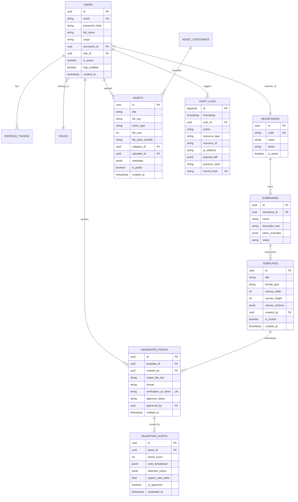

# DOCUMENTO 06: MODELO DE DATOS RELACIONAL Y POLÍTICAS DE ALMACENAMIENTO
## EL ALTO DIGITAL EASYSTEM (EASystem)
**Gobierno Autónomo Municipal de El Alto — Dirección de Comunicación**

---

### METADATOS DEL DOCUMENTO
- **Código**: `DOC-SDD-006`
- **Versión**: `1.0.0`
- **Fecha**: `2026-09-29`
- **Estado**: `Aprobado por el Equipo Multidisciplinario`
- **Autores**: Arquitecto de Software Senior & Administrador de Base de Datos (DBA)

---

## 1. ESQUEMA RELACIONAL POSTGRESQL (DIAGRAMA ER)



---

## 2. DDL DE TABLAS CORE Y POLÍTICA DE AUDITORÍA INMUTABLE

```sql
-- Creación de Extensiones Requeridas
CREATE EXTENSION IF NOT EXISTS "uuid-ossp";
CREATE EXTENSION IF NOT EXISTS "pgcrypto";

-- Esquema de Auditoría Inmutable
CREATE SCHEMA IF NOT EXISTS audit;

CREATE TABLE audit.logs (
    id BIGSERIAL PRIMARY KEY,
    timestamp TIMESTAMPTZ NOT NULL DEFAULT NOW(),
    user_id UUID REFERENCES public.users(id),
    action VARCHAR(64) NOT NULL,
    resource_type VARCHAR(64) NOT NULL,
    resource_id VARCHAR(128) NOT NULL,
    ip_address INET,
    payload_diff JSONB,
    previous_hash VARCHAR(64),
    record_hash VARCHAR(64) NOT NULL UNIQUE
);

-- Trigger de Inmutabilidad Criptográfica para Auditoría
CREATE OR REPLACE FUNCTION audit.generate_hash_chain()
RETURNS TRIGGER AS $$
DECLARE
    last_hash VARCHAR(64);
BEGIN
    SELECT record_hash INTO last_hash FROM audit.logs ORDER BY id DESC LIMIT 1;
    NEW.previous_hash := COALESCE(last_hash, 'GENESIS_EASYSTEM_EL_ALTO_2026');
    NEW.record_hash := encode(digest(
        NEW.timestamp::text || 
        COALESCE(NEW.user_id::text, '') || 
        NEW.action || 
        NEW.resource_id || 
        COALESCE(NEW.payload_diff::text, '') || 
        NEW.previous_hash, 
        'sha256'
    ), 'hex');
    RETURN NEW;
END;
$$ LANGUAGE plpgsql;

CREATE TRIGGER trg_audit_hash_chain
BEFORE INSERT ON audit.logs
FOR EACH ROW EXECUTE FUNCTION audit.generate_hash_chain();
```

---

## 3. POLÍTICAS DE ALMACENAMIENTO S3 / MINIO
1. **Reglas de Retención**:
   - `easystem-public`: Acceso anónimo de solo lectura para descargas de prensa y logos; CDN con caché de 30 días.
   - `easystem-vault`: Acceso restringido vía URLs pre-firmadas con expiración de 10 minutos para descargas de artes editables.
   - `easystem-renders`: Almacenamiento con ciclo de vida (renders temporales eliminados a los 60 días; piezas oficiales aprobadas preservadas de forma permanente).
2. **Estructura de Paths Canónicos**:
   - `/logos/{version}/{monochrome|color}/{lang}/{asset_name}.svg`
   - `/templates/{category}/{id}/schema.json`
   - `/renders/{secretaria_code}/{YYYY}/{MM}/{unique_id}.pdf`
