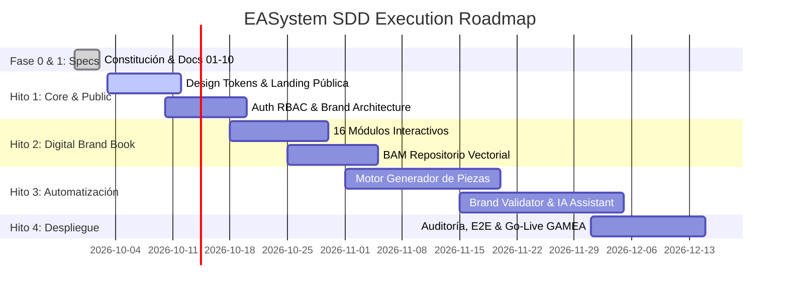

# DOCUMENTO 08: PLAN DE IMPLEMENTACIÓN, HITOS Y WBS (WORK BREAKDOWN STRUCTURE)
## EL ALTO DIGITAL EASYSTEM (EASystem)
**Gobierno Autónomo Municipal de El Alto — Dirección de Comunicación**

---

### METADATOS DEL DOCUMENTO
- **Código**: `DOC-SDD-008`
- **Versión**: `1.0.0`
- **Fecha**: `2026-09-29`
- **Estado**: `Aprobado por el Equipo Multidisciplinario`
- **Autores**: Product Owner & Arquitecto de Software Senior

---

## 1. CRONOGRAMA DE HITOS ESTRATÉGICOS (MILESTONES)

---

## 2. DESGLOSE DE TAREAS ATÓMICAS (WBS)

### PAQUETE DE TRABAJO 1: Portal Institucional & Design Tokens Core
- [x] **WP-1.1**: Definición formal de la Constitución y Filosofía de Marca.
- [ ] **WP-1.2**: Generación del paquete `@easystem/tokens` (W3C standard JSON, CSS y TypeScript).
- [ ] **WP-1.3**: Desarrollo de la Landing Page Pública con Hero interactivo, historia de la marca alteña, metáfora del aguayo y visor de colores oficiales.
- [ ] **WP-1.4**: Micro-animaciones y soporte responsive para móviles y conexiones de baja latencia.

### PAQUETE DE TRABAJO 2: Identidad, RBAC & Brand Architecture
- [ ] **WP-2.1**: Implementación de PostgreSQL con esquemas `auth`, `brand`, `audit`.
- [ ] **WP-2.2**: Flujo de autenticación JWT segura con roles: `ADMIN`, `DIRCOM`, `DISENADOR`, `USUARIO_MUNICIPAL`, `AUDITOR`.
- [ ] **WP-2.3**: Módulo de Brand Architecture tipo NYC: relación de Marca Madre con las 12 Secretarías del GAMEA y generador de logotipos subordinados.

### PAQUETE DE TRABAJO 3: Digital Brand Book (16 Módulos Interactivos)
- [ ] **WP-3.1**: Módulos 1 a 4: Filosofía, Misión, Visión, Valores alteños.
- [ ] **WP-3.2**: Módulos 5 a 6: Concepto del Aguayo y Patrones Textiles dinámicos.
- [ ] **WP-3.3**: Módulos 7 a 10: Imagotipo, Retícula 'X', Área Segura y Galería de Usos Incorrectos interactiva.
- [ ] **WP-3.4**: Módulos 11 a 12: Paleta Cromática (con copiador HEX/RGB/CMYK de un clic) y Tipografías Gotham/Poppins.
- [ ] **WP-3.5**: Módulos 13 a 16: Aplicaciones prácticas: Papelería oficial, Merchandising, Escenografías/Eventos y Parque Automotor Municipal.

### PAQUETE DE TRABAJO 4: Motor de Generación Gráfica Automática
- [ ] **WP-4.1**: Engine Canvas WYSIWYG en cliente con capas protegidas contra alteración indebida.
- [ ] **WP-4.2**: Renderer backend con Sharp y PDFKit para salida a 300 DPI CMYK (afiches y papelería) y PNG/WebP (redes sociales).
- [ ] **WP-4.3**: Módulo generador de Comunicados Oficiales con inserción automática de código QR criptográfico para verificación pública ciudadana.

### PAQUETE DE TRABAJO 5: Brand Validator & Alto IA Assistant
- [ ] **WP-5.1**: Algoritmo de detección de deformación geométrica del imagotipo.
- [ ] **WP-5.2**: Analizador de histograma cromático para comprobar presencia estricta de la paleta oficial.
- [ ] **WP-5.3**: Cálculo de Brand Score ponderado (0 a 100%) con retroalimentación visual inmediata.
- [ ] **WP-5.4**: Agente de IA para redacción de boletines de prensa institucionales y consultorio de dudas de marca.
