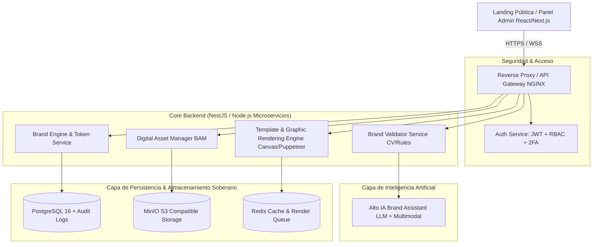

# FASE 0: CONSTITUCIÓN DEL PROYECTO SDD
## EL ALTO DIGITAL EASYSTEM (EASystem)
**Ecosistema Inteligente de Identidad Visual, Gobernanza de Marca y Comunicación Institucional**
*Gobierno Autónomo Municipal de El Alto (GAMEA) — Dirección de Comunicación*

---

### EQUIPO MULTIDISCIPLINARIO RESPONSABLE:
- **Arquitectura de Software Gubernamental Senior**: Definición de microservicios, seguridad institucional, soberanía y escalabilidad.
- **Product Owner (Transformación Digital Municipal)**: Alineación estratégica, necesidades de secretarías, simplificación de trámites y flujos públicos.
- **UX/UI Lead & Design Systems Specialist**: Gobernanza visual tipo NYC Design System, Design Tokens W3C, accesibilidad WCAG 2.1 AA.
- **Dirección de Comunicación Institucional**: Control de narrativa, directrices de vocería, campañas y aprobación jerárquica.
- **Especialista en Branding Público**: Protección de imagotipo, rescate del concepto del aguayo, normativas y semiótica visual alteña.
- **DevOps & Cloud Engineer**: Infraestructura self-hosted (Docker, Kubernetes/Coolify, PostgreSQL, MinIO S3, CI/CD).
- **Especialista en IA Gubernamental**: Modelos multimodales para auditoría de cumplimiento de marca (Computer Vision) y asistente generativo institucional (LLM).

---

## 1. NOMBRE OFICIAL Y METADATOS DEL PROYECTO

- **Nombre Oficial**: **EL ALTO DIGITAL EASYSTEM** (Acrónimo: **EASystem**)
- **Subtítulo Institucional**: *"El Corazón de la Metrópoli en la Era Digital"*
- **Lema del Sistema**: *"Un sistema inteligente para proteger, gestionar y evolucionar la identidad visual y comunicacional de la ciudad de El Alto."*
- **Entidad Patrocinadora**: Dirección de Comunicación — Gobierno Autónomo Municipal de El Alto (GAMEA).
- **Repositorio / Workspace**: `EASystem`
- **Metodología de Desarrollo**: **SDD (Spec-Driven Development)** reforzado con Spec Kit y arquitectura gobernada por especificaciones vivas.

---

## 2. VISIÓN Y PROPÓSITO ESTRATÉGICO

### 2.1. Visión
Convertir el **Manual de Imagen Institucional de El Alto** de un documento estático e inerte (PDF de 100+ páginas que rara vez se respeta) a un **Ecosistema Digital Vivo, Automatizado y Soberano**. 

EASystem garantiza que toda pieza gráfica, audiovisual, documento oficial y material de merchandising producido por secretarías, direcciones, imprentas y medios cumpla con el 100% de la identidad alteña, eliminando la dispersión visual, la distorsión del imagotipo y la burocracia en aprobaciones.

### 2.2. Semiótica e Identidad Alteña
El sistema fusiona el orgullo histórico y la fuerza productiva de la ciudad más joven y pujante de Bolivia:
- **Concepto del Aguayo**: El tejido andino como metáfora de interoperabilidad, entramado social, líneas dinámicas y diversidad cultural.
- **Cromaticidad Oficial**:
  - `Principal`: Púrpura Alteño (`#4B008F`) — Autoridad, dignidad, institucionalidad y vanguardia.
  - `Complementario 1`: Rosa Rebelde / Vanguardia (`#F5007B`) — Juventud, dinamismo y festividad.
  - `Complementario 2`: Turquesa Integración (`#008F89`) — Futuro, tecnología y visión de ciudad moderna.
  - `Complementario 3`: Oro Cultura / Sol Andino (`#F5B400`) — Riqueza cultural, pujanza comercial y luz altiplánica.
  - `Complementario 4`: Púrpura Profundo (`#690BB2`) — Jerarquía y soporte visual.
- **Tipografías Institucionales**:
  - `Titulares y Logotipos`: **Gotham** (Sólida, geométrica, contundente, moderna).
  - `Lectura, UI y Cuerpos de Texto`: **Poppins** (Geométrica, humana, altamente legible en pantallas y medios impresos).

---

## 3. ALCANCE DEL SISTEMA

### 3.1. En Alcance (In Scope)
1. **Portal Público y Landing Institucional**: Exhibición interactiva del orgullo de marca, historia, concepto del aguayo, visión de ciudad digital y acceso unificado.
2. **Digital Brand Book Interactivo (16 Módulos)**: Sustitución total del manual estático por guías interactivas con descarga directa de assets en formatos vectoriales y alta resolución.
3. **Motor de Design Tokens (W3C Standard)**: Tokens centralizados de colores, tipografía, espaciados, bordes, sombras y retículas que alimentan web, apps y motores gráficos.
4. **Sistema de Brand Architecture (Inspirado en NYC Design System)**: Gestión jerárquica de la Marca Madre ("El Alto: Corazón de la Metrópoli"), Submarcas (Alcaldía, Secretarías, Direcciones) y Marcas de Campaña/Eventos.
5. **Brand Asset Management (BAM / Biblioteca Digital de Recursos)**: Repositorio centralizado con control de versiones, categorización (`/logos`, `/svg`, `/png`, `/plantillas`, `/fotografias`, etc.) y firmas de uso autorizado.
6. **Motor de Generación Gráfica Automatizada**: Canvas y renderizador servidor para creación instantánea de piezas (comunicados, afiches, banners de redes, credenciales, certificados) sin requerir software de diseño complejo.
7. **Brand Validator Automatizado**: Motor de auditoría visual con Computer Vision y reglas de tokens que calcula el índice de cumplimiento de marca (Brand Score 0 - 100%) detectando deformaciones, colores HEX erróneos y fuentes no autorizadas.
8. **Alto IA Brand Assistant**: Agente inteligente multimodal para redacción institucional en tono ciudadano y asesoramiento normativo en tiempo real.
9. **Dashboard y Flujo de Aprobaciones**: Panel administrativo con métricas de uso por secretaría, gestión de roles estrictos y workflow de validación para el Director de Comunicación.

### 3.2. Fuera de Alcance en Fase Inicial (Out of Scope - Futuras Fases)
- Pasarelas de cobro de impuestos o tasas municipales ciudadanas (pertenecientes al sistema tributario RUAT/ATM).
- Votación electrónica o presupuestos participativos en blockchain (módulos contemplados para Fase 3).
- Generación de video broadcast 4K en tiempo real (se cubrirá generación de templates de intro/outro en Fase 2).

---

## 4. OBJETIVOS ESTRATÉGICOS E INDICADORES DE ÉXITO (OKRs)

| Objetivo Estratégico | Indicador Clave (KR) | Meta |
|---|---|---|
| **Estandarización Total de Marca** | % de piezas emitidas por secretarías con validación oficial | > 95% de cumplimiento de marca (Score 100%) |
| **Agilidad en Comunicación de Crisis** | Tiempo de generación y publicación de comunicados oficiales | Reducción de 2.5 horas a menos de 3 minutos |
| **Eficiencia Operativa Municipal** | Solicitudes de diseño resueltas mediante autoservicio de plantillas | 70% de materiales rutinarios generados automáticamente |
| **Soberanía Tecnológica** | Dependencia de software SaaS de terceros para activos de marca | 0% (100% self-hosted en infraestructura municipal) |
| **Trazabilidad y Auditoría** | Registro histórico inmutable de piezas publicadas y aprobadas | 100% de trazabilidad por dirección y usuario |

---

## 5. MAPA DE STAKEHOLDERS Y MATRIZ RACI

### 5.1. Actores y Perfiles
1. **Dirección de Comunicación (DirCom)**: Máxima autoridad rectora de la narrativa, aprobación de campañas y control editorial.
2. **Equipo de Diseño Gráfico Institucional**: Creadores de templates maestros, administradores del Brand Book y definidores de tokens.
3. **Secretarías y Direcciones Municipales (Usuarios Operativos)**: Solicitantes y generadores de comunicados, afiches y convocatorias para sus programas.
4. **Autoridades Municipales (Alcaldesa, Concejales, Secretarios)**: Validación de línea estratégica y recepción de reportes de impacto y tendencias.
5. **Proveedores e Imprentas Autorizadas**: Acceso controlado y auditado para descarga de artes finales en CMYK/vector sin alterar especificaciones.
6. **Auditores y Control Interno**: Supervisión de transparencia, historial y uso debido de la imagen oficial del Estado Municipal.
7. **Ciudadanía Alteña**: Consumidores finales de una comunicación clara, digna, moderna, transparente y visualmente coherente.

### 5.2. Matriz RACI Inicial
| Módulo / Proceso | DirCom | Diseñadores | Secretarías | Proveedores | Auditoría |
|---|---|---|---|---|---|
| **Publicación de Tokens y Brand Book** | A | R | I | I | I |
| **Aprobación de Campañas de Alto Impacto** | A / R | C | C | I | I |
| **Generación de Comunicados Rápidos** | A | C | R | I | I |
| **Descarga de Manuales y Vectores** | I | R | R | R | I |
| **Auditoría de Cumplimiento (Brand Score)** | I | C | R | R | A |

*(R = Responsible, A = Accountable, C = Consulted, I = Informed)*

---

## 6. ARQUITECTURA TÉCNICA INICIAL (ENTERPRISE GOVERNMENT READY)



- **Frontend**: Next.js 14+ (App Router), Vanilla CSS / Design Tokens Tokens-Studio compliant, Lucide Icons, Canvas API / Fabric.js / Konva.
- **Backend**: NestJS (TypeScript estricto), arquitectura modular hexagonal, microservicios desacoplados.
- **Base de Datos**: PostgreSQL 16 con extensiones para auditoría (`audit_trigger`) y particionado por esquemas.
- **Almacenamiento de Objetos**: Interfaz estándar S3 (MinIO Self-hosted con buckets versionados para logos, fuentes y assets).
- **Procesamiento Asíncrono de Imágenes/PDFs**: BullMQ + Redis + Sharp + Puppeteer/PDFKit para renderizado a 300 DPI CMYK y web RGB.
- **Motor IA**: Integración de modelos multimodales locales / API soberana para análisis compositivo de piezas gráficas y generación de copy institucional.
- **Infraestructura**: Docker, Docker Compose / Coolify para despliegue On-Premise en servidores municipales de El Alto.

---

## 7. MÓDULOS PRINCIPALES DEL SISTEMA

```
EASystem (Plataforma Integral)
├── M01: Portal Público & Landing de Ciudad Digital
├── M02: Sistema de Identidad, Autenticación y RBAC (5 Roles)
├── M03: Brand Architecture Manager (NYC System Inspired)
├── M04: Digital Brand Book Interactivo (16 Módulos Normativos)
├── M05: Design Tokens Engine (W3C JSON Specs & Sync)
├── M06: BAM (Brand Asset Management - Repositorio Vectorial)
├── M07: Generador Gráfico Automático Multiformato (Web, Social, Print)
├── M08: Brand Validator (Auditoría Automática & Brand Score)
├── M09: Alto IA Brand Assistant (Copiloto de Marca y Narrativa)
└── M10: Dashboard Administrativo, Métricas & Auditoría Institucional
```

---

## 8. REQUERIMIENTOS INICIALES DEL SISTEMA

### 8.1. Requerimientos Funcionales Críticos (RF)
- **RF-01 (Jerarquía de Submarcas)**: Capacidad de generar y administrar identificadores visuales subordinados para secretarías manteniendo el ADN de la marca madre.
- **RF-02 (Brand Book Interactivo)**: Cada regla (área de reserva, tamaño mínimo, paleta HEX/CMYK/Pantone) debe permitir prueba interactiva y descarga del activo asociado.
- **RF-03 (Generación Instantánea de Comunicados)**: Creación de comunicados oficiales de prensa en menos de 60 segundos con firma digital QR verificable.
- **RF-04 (Validación de Deformación y Color)**: Subida de artes en JPG/PNG/PDF que retorne diagnóstico: "Marca aprobada (Score 100%)" o listado de infracciones (fuente incorrecta, distorsión dimensional de isotipo, color alterado).
- **RF-05 (Exportación Multi-Soporte)**: Salida en PNG (Redes), SVG (Vectorial), PDF/X-1a (Imprenta 300 DPI) y PPTX (Presentaciones oficiales).

### 8.2. Requerimientos No Funcionales (RNF)
- **RNF-01 (Soberanía y Self-Hosting)**: 100% operable en servidores propios del GAMEA sin fuga de datos institucionales a plataformas de terceros.
- **RNF-02 (Rendimiento)**: Tiempo de carga inicial de la Landing Pública < 1.2 segundos (Lighthouse Score > 95/100).
- **RNF-03 (Disponibilidad y Tolerancia a Fallos)**: Disponibilidad 99.9% para la consulta pública de manuales y validación de comunicados.
- **RNF-04 (Seguridad de Grado Gubernamental)**: OWASP Top 10 compliance, tokens JWT cifrados con rotación, registros de auditoría inmutables por cada descarga o edición.

---

## 9. ROADMAP DE IMPLEMENTACIÓN SDD (FASES)

```
[FASE 0] Constitución del Proyecto SDD (Documento 00)  <-- FASE ACTUAL COMPLETADA
    │
    ▼
[FASE 1] Especificación Completa del Sistema (Documentos 01 al 05)
    ├── Doc 01: Visión del Producto & Brand Philosophy
    ├── Doc 02: Requerimientos Funcionales Detallados (User Stories)
    ├── Doc 03: Requerimientos Técnicos & Seguridad Gubernamental
    ├── Doc 04: Arquitectura de Software & Microservicios
    └── Doc 05: Sistema de Diseño UX/UI & Design Tokens W3C
    │
    ▼
[FASE 2] Modelado, Contratos e Integraciones (Documentos 06 al 10)
    ├── Doc 06: Modelo de Datos Relacional & Políticas de Almacenamiento
    ├── Doc 07: Contratos de API (OpenAPI 3.1 & SDK de Tokens)
    ├── Doc 08: Plan de Implementación, Dependencias & Milestones
    ├── Doc 09: Estrategia de Pruebas (Unit, Integration, E2E, Brand Testing)
    └── Doc 10: Runbook de Despliegue On-Premise / Docker / Coolify
    │
    ▼
[FASE 3] Ejecución del Flujo SDD & Construcción del Código Fuente
    ├── Tareas atómicas ordenadas por dependencias
    ├── Implementación verificada por pruebas funcionales observables
    └── Entrega y Puesta en Producción
```

---

## 10. REGLA FUNDAMENTAL SDD
**"Specs antes de código"**: Queda formalmente constituido que el desarrollo de componentes de software de EASystem se iniciará únicamente tras la culminación y aprobación de los 10 documentos de especificación técnica y de producto.
